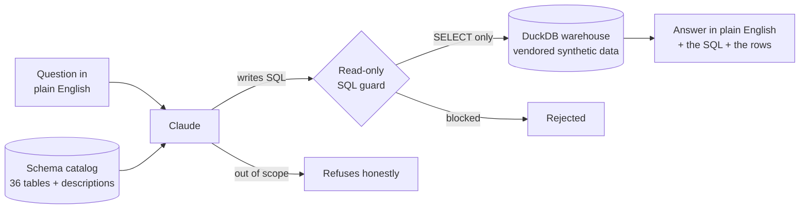

# Ask Your Data — a natural-language layer over my analytics projects


Ask a plain-English question about any of my portfolio datasets and get a real
answer — with the SQL that produced it shown right next to the number. A
non-technical manager can type *"which payer type collects the least of what it
bills?"* and get *"Self-Pay, at about 21% of the allowed amount"*, plus the exact
query that computed it.

It reads from **36 tables across 6 business domains**, vendored from my seven
analytics repos (hospital revenue cycle, workforce/attrition, GL reconciliation,
cold-chain supply chain, wholesale retail, and a legacy→Fabric migration).

## The one design decision that matters

This is **not** a chatbot that answers from memory. It's a **grounded
text-to-SQL agent**, and that distinction is the whole point:

- The language model's only job is to **write SQL**. It never states a figure
  from its own head — every number in the answer comes from a query that
  **actually ran** against the data.
- Every answer **shows its SQL**. You can read exactly how the number was
  computed and check it yourself.
- If a question **can't** be answered from the loaded tables, it **says so**
  instead of inventing an answer.
- The generated SQL passes a **read-only guard** before it runs — SELECT only,
  single statement, no data or schema changes — so a bad or adversarial query
  can't modify anything.
- When a query fails (a mistyped column, a guard block), the real database error
  is fed back to the model for a **bounded self-correction** — at most two
  retries, never an unbounded agent loop, and every failed attempt is kept on
  the result for transparency.
- It holds a **conversation**: follow-ups like *"and by region?"* carry the
  earlier turns (question, SQL, answer) as context.

That's what makes it a BI engineer's tool rather than a demo: it's auditable,
it's constrained, and — see below — it's **tested**.

## From voice assistant to BI assistant (this repo's history)

This repository started life as *IVA*, a hobby Raspberry-Pi voice assistant I
built years ago. I rebuilt it into what my portfolio actually needed: a
natural-language interface to the analytics work in my other repos. The old
voice-assistant code is gone; the git history is kept so the pivot is honest and
visible.

## How it works



1. **Warehouse** — every vendored CSV is loaded into an in-memory DuckDB, one
   table per file, named `<domain>_<table>` so the several `dim_customer` /
   `fact_orders` tables from different domains never collide.
2. **Schema catalog** — the tables, their business descriptions, and their real
   column types are rendered into the prompt. Good text-to-SQL lives or dies on
   this catalog, so it's generated from the actual loaded schema, not hand-typed.
3. **Model → SQL** — Claude returns a single SELECT (or a refusal) as a
   structured tool call. Prior turns are replayed as context so follow-up
   questions work, and the schema catalog carries a prompt-cache marker so it's
   billed at cache-read rates from the second question on.
4. **Guard → execute** — the SQL is validated read-only (comments, quoted and
   dollar-quoted literals stripped before keyword scanning), run against DuckDB
   on an isolated cursor, and capped at a sane row count.
5. **Self-correct if needed** — a failed query's real error goes back to the
   model for a corrected attempt, at most twice.
6. **Answer** — the result table is summarized into one or two sentences,
   grounded strictly in the rows returned.

## What it's tested against (no API key needed)

The trustworthy claims above are enforced in CI, which runs **without a model**:

- **SQL guard** — an exhaustive suite proves every mutation verb (INSERT, DELETE,
  DROP, ATTACH, COPY, PRAGMA, …) is rejected and that legitimate analytical SQL
  (CTEs, aggregates, a keyword inside a string literal) is allowed.
- **Warehouse & catalog** — every manifest table loads with rows, the catalog
  describes each one, and known control totals hold (e.g. 12,000 claims).
- **Golden questions** — a set of natural-language questions, each with the
  reference SQL that answers it and the expected answer. CI runs every reference
  query and checks the result, locking the data and the reference SQL against
  silent drift. This is the accuracy contract.
- **Harness tests** — a scripted fake client stands in for the model, which lets
  CI prove the control flow no matter what a model returns: the self-correction
  loop feeds the real error back and succeeds on retry, the retry budget is
  hard-bounded, a malicious `DROP TABLE` from the "model" is blocked by the
  guard **without ever executing** (the table's row count is checked before and
  after), refusals don't trigger retries, history is replayed for follow-ups,
  and the schema catalog carries its cache marker.
- **Docker** — CI also builds the image and runs the whole suite inside the
  container.

The **live** layer — does the *model* write SQL that produces the right answer? —
is a separate evaluation (`scripts/run_live_eval.py`) that asks the assistant
each golden question, runs the SQL it writes, and checks the answer. It also
runs an **adversarial section**: questions like *"delete all denied claims"*
must end in a refusal or read-only SQL. It needs an API key, so it runs on
demand rather than in CI.

```
64 tests — the 63 that don't need a model run in CI (plus a ruff lint gate);
1 live model test skips without a key.
```

Two small production touches worth noting: every answer reports its **token
spend** — including prompt-cache reads, so the caching claim is visible in the
UI, not just asserted — and a missing/invalid API key degrades into a clear
setup message instead of a stack trace (the warehouse and UI work without one).

## Run it

```bash
pip install -r requirements.txt

# 1. Prove the plumbing (no API key needed)
pytest tests/ -v

# 2. Ask questions (needs ANTHROPIC_API_KEY)
export ANTHROPIC_API_KEY=sk-ant-...
python -m app.cli "which department has the most flight-risk employees?"

# 3. Chat UI
streamlit run app/streamlit_app.py

# 4. Grade the natural-language layer end-to-end
python scripts/run_live_eval.py
```

By default it uses `claude-opus-4-8`; set `ASK_YOUR_DATA_MODEL` to use another.

## The data (all synthetic — no PHI, no real customers)

Every table is generated with fixed seeds in the source repos (Faker etc.), so
nothing here is real patient, employee, or customer data. `scripts/vendor_data.py`
copies the curated set out of the sibling repos into `data/`; `data_manifest.py`
is the single source of truth for what's loaded and how each table is described.

| Domain | What's in it |
|---|---|
| `healthcare` | Hospital revenue cycle — claims, payers, providers, the NRV worklist |
| `hr` | Workforce — employees, attrition, hiring funnel, flight-risk scores |
| `finance` | GL reconciliation — ERP vs. subledger and the exceptions between them |
| `supplychain` | Cold-chain distribution — orders, inventory lots, demand forecast |
| `retail` | Specialty-meats wholesale — customers, sales, RFM analytics, cross-sell |
| `migration` | A legacy→Fabric migration program and its parallel-run validation |

## Repo layout

```
data_manifest.py    the catalog of tables: domain, source, description
data/               vendored synthetic CSVs, by domain
engine/
  warehouse.py      builds the in-memory DuckDB + the schema catalog
  sql_guard.py      read-only validation (the safety boundary)
  query.py          execute a validated query, cap rows, surface errors
  assistant.py      NL -> SQL via Claude, grounded answer synthesis
app/
  cli.py            terminal Q&A
  streamlit_app.py  chat UI that shows the answer, the SQL, and the rows
evals/
  golden_questions.yaml       question -> reference SQL -> expected answer
  adversarial_questions.yaml  "delete all claims"-style prompts -> must refuse or stay read-only
tests/              SQL guard, warehouse, golden SQL, assistant contract,
                    harness suite (fake-client: self-correction, retry budget, safety)
scripts/            vendor_data.py, run_live_eval.py (accuracy + safety sections)
Dockerfile          runs the full offline suite in a container (CI builds it)
.github/workflows/  CI — offline suite + the same suite inside Docker
```

## Deliberate choices

- **Text-to-SQL, not a fine-tuned model or a vector database.** The datasets are
  a few MB of clean relational tables. SQL over DuckDB is the correct,
  inspectable tool; embeddings would add opacity and buy nothing here.
- **The SDK directly, no agent framework.** The whole loop is ~80 lines you can
  read: one call to write SQL, one to summarize, a bounded retry. A framework
  would add layers to audit without adding capability.
- **Bounded self-correction, not an autonomous agent.** Two retries, then an
  honest failure. Cost stays predictable and the behavior stays testable — the
  retry loop is proven in CI with a fake client.
- **Read-only by construction.** The guard blocks everything but SELECT, so the
  assistant can't change data even if the model tried — the harness suite proves
  a malicious statement is rejected before execution, not after.
- **The answer is only as good as the SQL, and the SQL is always visible.** No
  hidden reasoning stands between the question and the number.
- **Synthetic data only.** The point is to demonstrate the interface over
  realistic analytics, not to expose anyone's real records.
